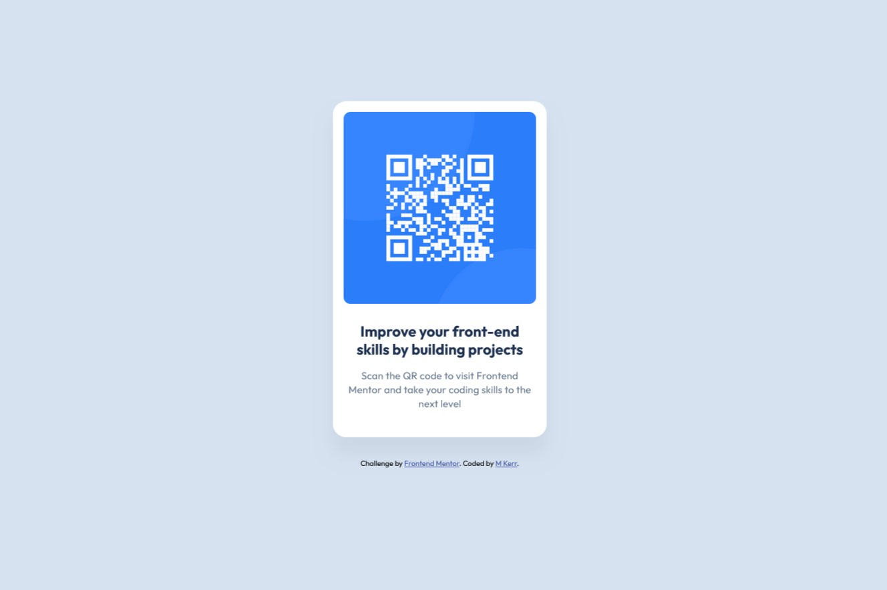

# Frontend Mentor - QR code component solution

This is a solution to the [QR code component challenge on Frontend Mentor](https://www.frontendmentor.io/challenges/qr-code-component-iux_sIO_H). Frontend Mentor challenges help you improve your coding skills by building realistic projects. 

## Table of contents

- [Overview](#overview)
  - [Screenshot](#screenshot)
  - [Links](#links)
- [My process](#my-process)
  - [Built with](#built-with)
  - [What I learned](#what-i-learned)
  - [Continued development](#continued-development)
  - [Useful resources](#useful-resources)
- [Author](#author)
- [Acknowledgments](#acknowledgments)

## Overview

### Screenshot




### Links

- Solution URL: https://www.frontendmentor.io/solutions/qr-code-component-solution-with-html5-and-css-uYgFCfDZ7D
- Live Site URL: https://mkerr-github.github.io/QR-code-component

## My process

### Built with

- Semantic HTML5 markup
- CSS custom properties
- VS Code editor

### What I learned

This was good practice for dealing with 
- Resetting default browser styles
- Managing borders, margins, and padding
- Horizontally and vertically centring elements

Most of all it was great for learning how to convert a design file (in this case from Figma) into a web component.

### CSS Excerpt :
```css
:root {
    /* Global variables */
    --White: hsl(0, 0%, 100%);
    --Slate-300: hsl(212, 45%, 89%);
    --Slate-500: hsl(216, 15%, 48%);
    --Slate-900: hsl(218, 44%, 22%);
}

* {
    /* Reset browser styles */
    padding: 0;
    margin: 0;
    box-sizing: border-box;
    -webkit-font-smoothing: antialiased;
}

body {
    background-color: var(--Slate-300);
    font-family: "Outfit", sans-serif;
    text-align: center;
    margin: 0;
    display: flex;
    flex-direction: column;
    align-items: center;
    justify-content: center;
    min-height: 100vh;
}

.card {
    width: 320px; /*let the content control the height*/
    background-color: var(--White);
    border-radius: 20px;
    box-shadow: 0px 25px 25px 0 hsla(0, 0%, 0%, .0477);
    overflow: hidden;
    padding: 16px 16px 40px 16px;
}

.card-image {
    max-width: 100%; /*to prevent the image overflowing*/
    border-radius: 10px;
}
```

### Continued development

I'm going to continue to undertake more practice projects that require creating these layouts.


### Useful resources

- [Chasing the Pixel-Perfect Dream](https://www.joshwcomeau.com/css/pixel-perfection/) - This is a great article about getting a layout exact and as close as possible to the design specification provided by the designer in Figma.

## Author

- My GitHub - [M Kerr](https://github.com/mkerr-github)
- Frontend Mentor - [@mkerr-github](https://www.frontendmentor.io/profile/mkerr-github)

## Acknowledgments

I initially completed the project without referring to any solutions or using AI and looking up as little as possible. I achieved a result that looked very close to the image provided, but the finer details such as padding, margin measurements, and the precise specifications were not as close as possible to the Figma design as they could be. 
This [Frontend Tribe Tutorial](https://www.youtube.com/watch?v=MOsWTckRPfk) was invaluable in demonstrating how to identify these small details in Figma carefully.

